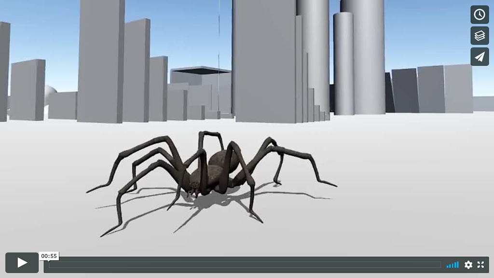
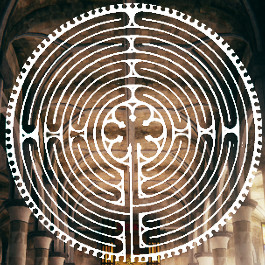
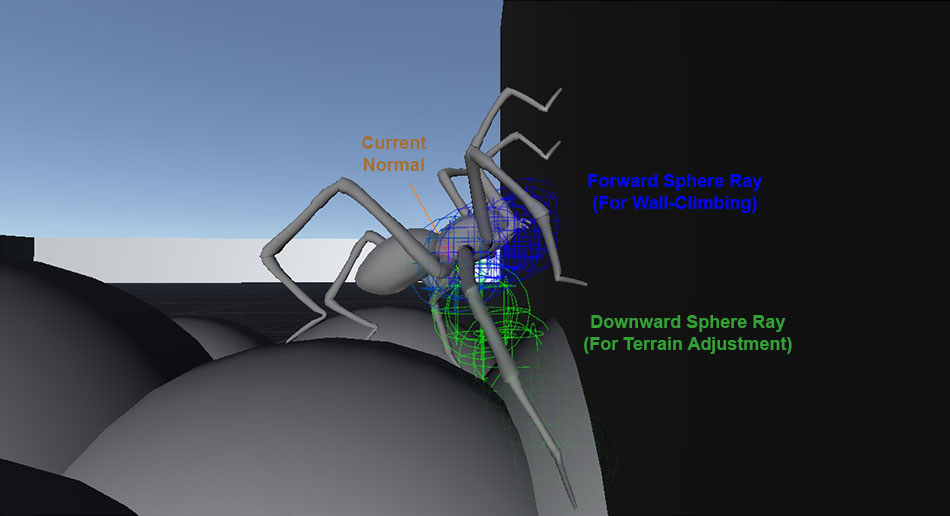
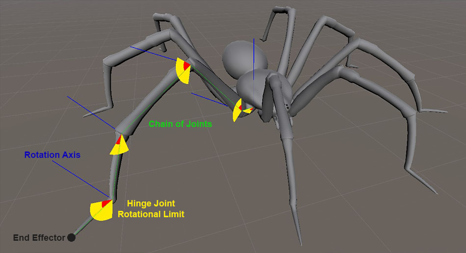
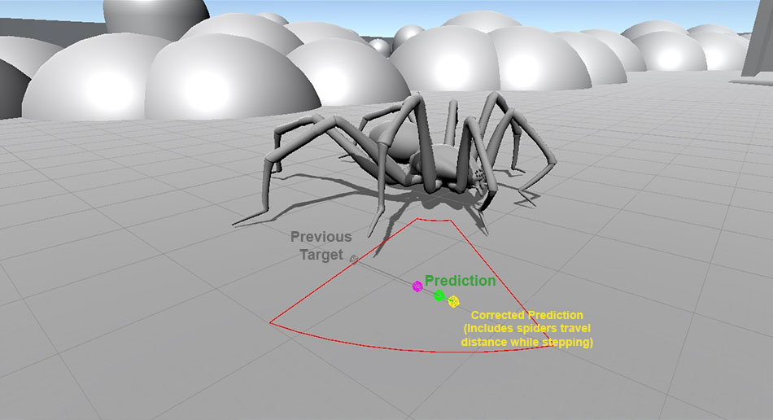
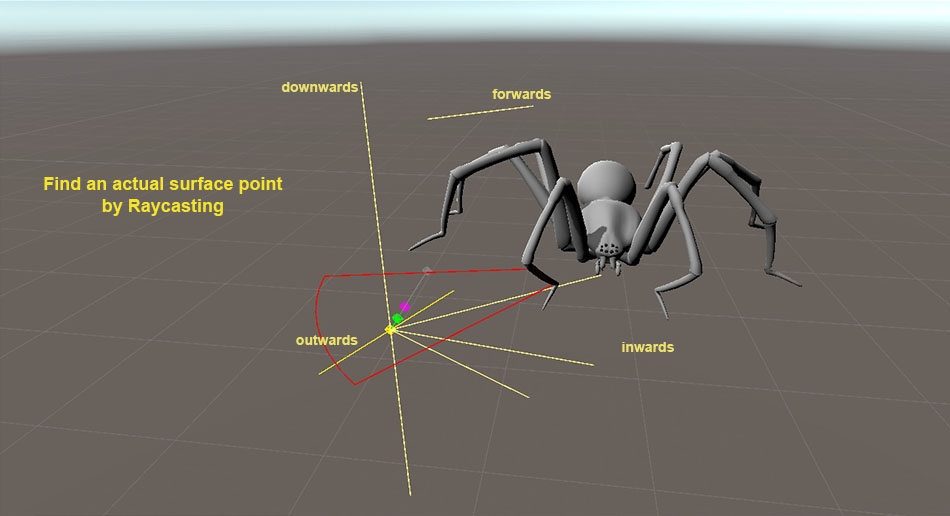

# Unity Procedural IK Wall Walking Spider

  
  
A Unity Engine Project in which a controllable wall-walking spider uses inverse kinematics (IK) to position its legs to its surroundings in a smart fashion, such that is moves realistically.
The user can freely control the spider, which is able to walk on any surface: walls, corners, ceilings, ... you name it!
While moving, the legs dynamically position themselves to the surroundings without the use of any animations, that is all the movement is procedural.

If you like this project and/or find it useful, please leave a **Star** on this repository.

## Features
  - Fully procedurally animated
  - Walk and climb on any surface
  - Fully controllable with intuitive camera controls
  - NPC mode (Random movement together with observing camera)
  
## Showcase

## What people say
> *"This spider was an important ingredient for my game. It wouldn't be as successful without it!"*

> *"The inverse kinematics on this spider are genius. I pretty much just "plug & played" the spider into my game, and it worked without any issues."*

> *"People playing with this spider are always amazed that it can climb walls and the ceiling. That gives the gameplay an important emotional content."*

 Jan Jileček (Developer of Jung's Labyrinth) 

## Used in these games

  
## Motivation
Back when I was developing a game, I created a spider which was able to walk on any surface. It was exciting to see the spider walk on, around, over and under any kind of object such as tables, chairs, lamps, food items etc.
However, since the thrill of controlling such a spider is to experience the world through its eyes and its scale it seemed very important for it to have very precise movement instead of the pre set animations it had at the time.
Controlling a spider, or any small creature at that, is very different from controlling a human for example, in that the player is already enticed by the very movement of the spider. For example, walking over a banana or a spoon can already feel exciting and fun for the player. And this could only be realized using some kind of dynamic movement using information gathered from the surroundings in realtime.

As I done more research, I stumbled upon inverse kinematics, and started implementing joints, chains of joints and an IK solving algorithm. However, the task isn't done by implementation of this system since the system solves a chain of joints for only a given target position. But how do I calculate the target position? When do I have to update it? There is a bunch of information needed to answer these questions, such as the topology of the surroundings, the movement of the spider, asynchronicity to other legs, the degrees of freedom the joints of the legs have etc. Implementing an IK system together with a smart system of calculating and predicting target positions gave me the procedural animation I wanted.

## How it works
For the wall-walking the spider uses sphere casting, that is downwards for terrain adjustment and forwards for wall-climbing. A fake gravity in respect to its current normal sticks the spider to the surface.

  
Show image

  
    

Each spider leg is modeled by a chain of hinge joints with implemented rotational limits and
for the IK solving part, the project uses a simple, yet tailored, CCD (Cyclic Coordinate Descent) algorithm.

  
Show images

  
  
  

A leg desires to step if the IK solver can not solve the leg sufficiently anymore, that is up to a set tolerance.
The stepping of all legs is controlled by a single managing class which respects each legs desire to step as well as their asyncronicity to other legs and ultimately decides when a step is allowed. There are two different approaches implemented. The first one being a queue based approach which for each leg respects neighbouring asynchronous legs (A more local approach), and the second one a so called "Alternating Tetrapod Gait" inspired by how spiders walk in real life which just separates the legs into two groups and allows the groups to step only in certain time frames (A more global approach).

An actual new step target is calculated by using an anchor position, defined in the spiders local coordinate frame, and drawing a line from the previous target to the anchor position, but extending it a bit. After correcting the new point by the spiders predicted travel distance while stepping, a system of raycasts is used to find an actual surface point to step to. The sytem of raycasts understands the topology of the surroundings by casting in different directions such as downwards, outwards, inwards, ..., such that ultimately the spider can step on varying types of terrain (not only somewhat flat).

  
Show images

  
  
  
  
  
  

Lastly, the spiders body elevates and rotates in correspondence to the legs heights, which together with all the above ultimately leads to realistic procedural animation.

## How to use?
1. Create a new Unity project
2. Drag and drop the files into your Unity project.
3. Open the scene "TestRoom" 
4. Press play and enjoy

## Credits
Special thanks to  for creating the spider model used in this project.

## License
For licensing, contact me at: [mail@PhilippSchofield.com](mailto:mail@PhilippSchofield.com)

**It is prohibited to sublicense and/or sell copies of this project in stores such as the Unity Asset Store!**

© Philipp Schofield 

